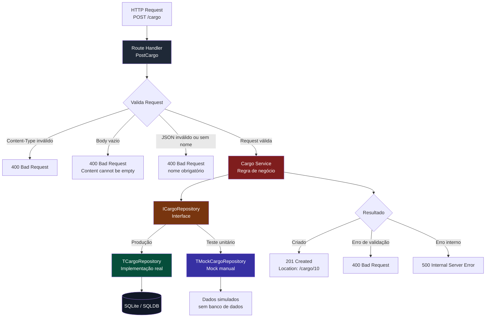
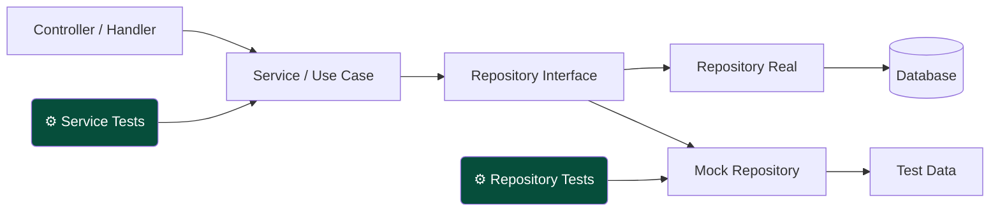

# Arquitetura Atual do Backend

## Fluxo atual do `/POST Cargo`

```mermaid
flowchart TD
    A[HTTP Request<br/>POST /cargo] --> B[Route Handler<br/>PostCargo]

    B --> C{Valida Request}
    C -->|Content-Type inválido| R400[400 Bad Request]
    C -->|Body vazio| R400B[400 Bad Request<br/>Content cannot be empty]
    C -->|JSON inválido ou sem nome| R400C[400 Bad Request<br/>nome obrigatório]
    C -->|Request válida| D[Cargo Service<br/>Regra de negócio]

    D --> E[ICargoRepository<br/>Interface]

    E -->|Produção| F[TCargoRepository<br/>Implementação real]
    F --> G[(SQLite / SQLDB)]

    E -->|Teste unitário| H[TMockCargoRepository<br/>Mock manual]
    H --> I[Dados simulados<br/>sem banco de dados]

    D --> J{Resultado}
    J -->|Criado| R201[201 Created<br/>Location: /cargo/10]
    J -->|Erro de validação| R400D[400 Bad Request]
    J -->|Erro interno| R500[500 Internal Server Error]

    style B fill:#1f2937,color:#fff
    style D fill:#7f1d1d,color:#fff
    style E fill:#78350f,color:#fff
    style F fill:#064e3b,color:#fff
    style H fill:#3730a3,color:#fff 
    style G fill:#111827,color:#fff
```

## Fluxo Simplificado Pronto Para Testes

```mermaid
flowchart LR
    A[Controller / Handler] --> B[Service / Use Case]
    B --> C[Repository Interface]
    C --> D[Repository Real]
    D --> E[(Database)]

    C --> F[Mock Repository]
    F --> G[Test Data]

    H(⚙️ Service Tests) --> B    
    I(⚙️ Repository Tests) --> F

    style H fill:#064e3b,color:#fff
    style I fill:#064e3b,color:#fff
```
